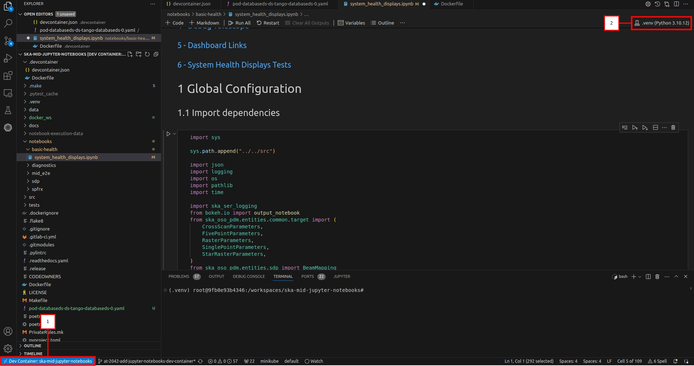
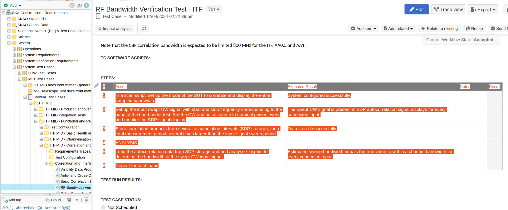

# SKA Mid Jupyter Notebooks

https://jira.skatelescope.org/browse/STS-1022

## Purpose

This repo contains notebooks intended to be executed against the Mid-ITF. These notebooks can be used to make demos easier to design and follow, as well as make them more repeatable for validation. Some more general notebooks can also be used as onboarding tools, to demonstrate how to interact with Mid-ITF, without having to do much setup.

## Environment Setup

### Prerequisites

When writing notebooks, be sure to run `git submodule init` and `git submodule update`. This will pull the latest .make directory for this repository, allowing full use of Make commands. In a Python venv, use `poetry install` to grab the libraries required by this repository itself. 

### Using Dev Container

This repository contains a VS Code development container configuration that can be used to automatically setup a development container for developing and running notebooks in an isolated environment from within VS Code. Follow these steps to use the development container:

1. Open VS Code and add the repository to the Workspace.
2. Click "_Open Remote Window_" in the bottom left corner and select the "Open folder in container..." option.
3. Once VS Code reopens (this may take some time if it is the first time you are building the container) select View > Terminal and run the following command in the terminal: `Poetry install` (this only needs to be done the first time you are running the container, or when python dependencies have been changed in _pyproject.toml_).
This will setup a virtual environment on your host bound to the development container and install all python dependencies.
4. In the top right corner of VS Code click on _Select Kernel_ > _Python Environments_ then select the following path: _.venv/bin/python_
5. If your environment looks similar to the image below, you have performed all the steps correctly and can continue.

#### Caveat: pre-existing .venv folder

Sometimes you may want to follow step 3 only above _after_ removing the `.venv` folder entirely first - if the virtual environment was for some reason created on your local machine, some of the imports will not work as expected. Simply delete the folder (right-click & delete or `$ rm -rf .venv` in terminal), then run `poetry install`.

## Using Notebooks

Most notebooks in this repository were developed with [VSCode's Jupyter Notebook functionality](https://code.visualstudio.com/docs/datascience/jupyter-notebooks) in mind, but can also be run via [JupyterLab](https://github.com/jupyterlab/jupyterlab-desktop). To run a notebook, it is recommended to use a [Python Virtual Environment](https://docs.python.org/3/library/venv.html), in order to keep libraries and versioning organized. A non-venv Python interpreter can also be used, but users will have to manage libraries and Python versions manually. 

## Writing Notebooks

### Importing Steps from Jama System Tests

1. Copy the steps in the table in the _Steps_ section and save them as a CSV file. If the steps include commas internally, consider saving the file using a different delimiter such as a semicolon (;):

2. Run the `convert_nb.py` script: `poetry run convertnb $CSV_SOURCE_FILE $NB_DEST_FILE`. Use the delimiter flag to specify an alternate delimiter if your CSV file does not use comma delimiters: `poetry run convertnb $CSV_SOURCE_FILE $NB_DEST_FILE -d ";"`

This will convert each step listed in the Jama test case into a section in the Juypyter Notebook. The _Action_ and _Expected Result_ will be added as a description to that step.

### Notebook Styling

When creating/updating a notebook, the following should be referenced: 
- [The SKAO code guidelines for Jupyter.](https://developer.skatelescope.org/en/latest/tools/codeguides/jupyter-notebook-codeguide.html)
- [The notebook template in this repository.](notebooks/template/notebook_template.ipynb).
- If writing configs, refer to the [relevant MID schemas.](https://developer.skao.int/projects/ska-telmodel/en/stable/schemas/midcbf/ska-mid-cbf.html)

## Committing  

When pushing to the remote, run `make notebook-lint` to preview any linting changes. To run the linter and make automatic changes to your notebooks run `make notebook-format`.

# Adding GUI elements to Jupyter Notebooks

For a short introduction and examples of using the *ipywidgets* library, refer to:

[How to add visual appeal to Jupyter Notebooks](https://confluence.skatelescope.org/display/SE/How+to+add+visual+appeal+to+Jupyter+Notebooks)

