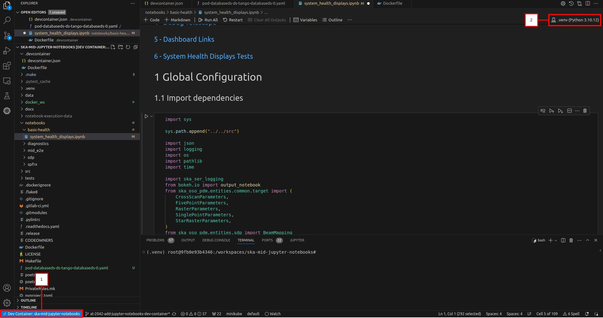

# SKA Mid Jupyter Notebooks

## Purpose

This repo contains notebooks intended to be executed against the Mid-ITF.

## Environment Setup
### Using Dev Container
This repository contains a VS Code development container configuration that can be used to automatically setup a development container for developing and running notebooks in an isolated environment from within VS Code. Follow these steps to use the development container:
1. Open VS Code and add the repository to the Workspace. 
2. Click "_Open Remote Window_" in the bottom left corner and select the "Open folder in container..." option.
3. Once VS Code reopens (this may take some time if it is the first time you are building the container) select View > Terminal and run the following command in the terminal: `Poetry install` (this only needs to be done the first time you are running the container, or when python dependencies have been changed in _pyproject.toml_).
This will setup a virtual environment on your host bound to the development container and install all python dependencies.
4. In the top right corner of VS Code click on _Select Kernel_ > _Python Environments_ then select the following path: _.venv/bin/python_
5. If your environment looks similar to the image below, you have performed all the steps correctly and can continue.

